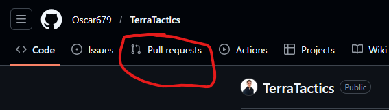

# Installation Steps
Run these commands inside an empty folder.

```bash
git clone https://github.com/Oscar679/TerraTactics.git
cd TerraTactics
npm install
rune-tools compile
npm test
```

# Workflow

## Always Pull Latest Version

```bash
git checkout main
git pull origin main
```

## Work On Branches
Create a branch for each feature.

```bash
git checkout -b <feature-name>
```
Example:
```bash
git checkout -b healthbar
```

## Push A Branch To The Repository
```bash
git add .
git commit -m "Describe your change"
git push -u origin <feature-name>
```
Example:
```bash
git add .
git commit -m "Added healthbar to character"
git push -u origin healthbar
```
## Create A Pull Request

1. Push your branch to GitHub.
2. Open the repository on GitHub.
3. Click on `Pull Requests`.
4. Click `New pull request`.
5. Choose your branch.
6. Click `Create pull request`.
7. After review, merge the pull request into `main`.

# TerraTactics

## Goal
Defeat the other player before the lava rises.

## Controls
Left/Right: Move  
Up: Jump  
Q: Open/Close weapon menu  
Mouse: Aim and shoot  

## Gameplay Loop
Player has 10 Seconds to make a move.

1. Player takes a turn.
2. Select weapon.
3. Aim and fire.
4. Projectile hits terrain/player or leaves screen.
5. Turn switches.
6. Game ends when one player reaches 0 health or falls into lava.
